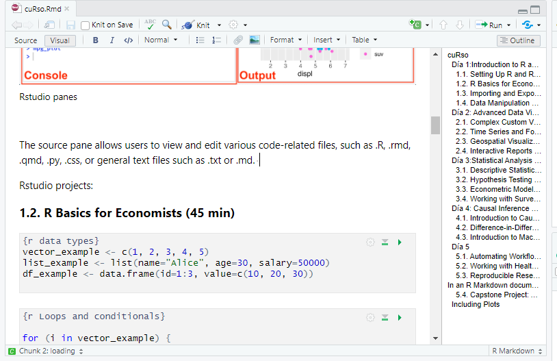
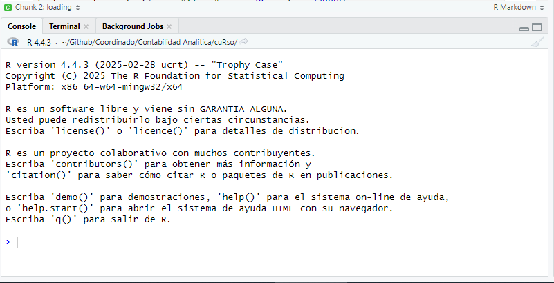
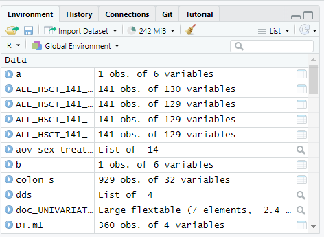
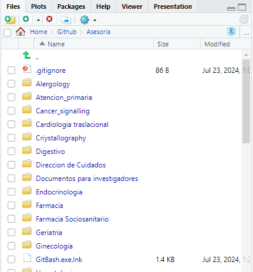

# cuRso

## Day 1:Introduction to R and Data Handling (3 hours)

R as a language: Most people think of R as a computer program, similar to SAS or SPSS. R is a computer program, but it is also a computer language.

R is open-source. (free, available code, modifiable)

R can be used on Mac, linux or Windows.

**Origin**:

*"...In the begining there was S ..."*


the S language was developed in 1984 to be a novel way of carrying out data analyses, and evolved into S-Plus (a commercial program).

**R** started as a poor man’s home-brewed implementation of S, for use in teaching developed by **R**obert Gentleman and **R**oss Ihaka *(hence the name R)*.

base R: language and few functions

R packages (libraries): new functions for R. *[more than 20000 packages!]*

Rstudio:

The R program does not have a full-fledged graphical user interface (GUI).

R can be used with Rstudio (Integrated Development Environment) that helps you visualize, code, and interact with "things".

(other IDEs are available).

### 1.1. Setting Up R and understanding RStudio (60 min)

```{r installing packages}
install.packages(c("tidyverse", "DBI", "odbc", "readxl"))

```

```{r loading packages}
library(tidyverse)
library(DBI)
library(odbc)
library(readxl)
library(haven)
```

Rstudio panes:

[](https://docs.posit.co/ide/user/ide/guide/ui/ui-panes.html)

**Source pane**

Allows users to view and edit various code-related files, such as .R, .rmd, .qmd, .py, .css, or general text files such as .txt or .md. 

[](https://docs.posit.co/ide/user/ide/guide/ui/ui-panes.html)

**Console pane:**

By default the console pane is the bottom left pane.

-   **Console tab** provides an area to interactively execute code. By default it is tied to R, but through the use of the `reticulate` package, it can also provide a Python console.

-   **Terminal** tab for executing system commands, adding or removing additional integrated terminals, as well as general controls of the current selected terminal.

[](https://docs.posit.co/ide/user/ide/guide/ui/ui-panes.html)

**Rstudio Environment Pane**

[](https://docs.posit.co/ide/user/ide/guide/ui/ui-panes.html)

The **environment tab** displays currently saved R and Python objects. *(The R icon can be toggled between R or Python environment objects)*

```{r store an object in the environment}
avg_mpg <- mean(mtcars$mpg)
# avg_mpg = mean(mtcars$mpg)
```

```{r remove object from environment}
rm(avg_mpg)

```

-   The **history tab** displays the commands that were executed in the current session

-   The **connection tab** displays the connections to local or remote databases *(i.e. SQL SERVER)*

-   The **version control system tab** will change based on the version control system you have enabled for that session. *For example*, using **Git** will change the tab name to Git and provide its own commands.

**Output pane**

the bottom-right pane and displays various outputs such as plots, HTML content, or on-disk files

[](https://docs.posit.co/ide/user/ide/guide/ui/ui-panes.html)

-   **Files tab** provides interactive exploration of the current R Project along with the entire directory

-   **Plots tab** will display static images generated by code until the session is restarted.

-   The **package tab** allows for viewing currently installed R packages, and has a search bar for searching the current library of packages

-   The **help tab** is used to display package documentation and vignettes. There are arrows for navigating backwards and forwards as additional help pages are viewed. The home icon will return to the general help page, with links to Resources, Manuals, References, and Posit Support.

```{r}
?paste0()
# or
help(paste0)
```

Getting help from the internet. **Google and Stackoverflow** are your friends

-   Nowadays, **StackOverflow** (<http://stackoverflow.com/>) is the best question-andanswer (Q & A) support site for R. Within the StackOverflow site there is an R collective. In most cases, searching for existing questions and their answers will be all that you need to do. If asking a question, make sure that it is really a new question. If there is some question that looks similar, make clear how your question is different.

-   Asking chatGPT/perplexity for help

    **ChatGPT** or **perplexity** (more oriented towards data science) will help you code in R depending on your needs. Sometimes it will hallucinate and tell you that some things are possible when they are not. Never trust without critical revision.

    **Do not enter patient data in chatGPT or** **perplexity!!!!**

### 1.2. R Basics for Economists (45 min)

```{r lists and vectors}
#this is a commentary 
vector_example <- c(1, 2, 3, 4, 5)#this is a commentary
fourth_vector_example<-c(1, 2, "3", 4, 5)
class(vector_example)
class(fourth_vector_example)

list_example <- list(name="Alice", age=30, salary=50000)


second_vector_example<-c("a","b","c","d","e")
third_vector_example<-1:5

```

Dataframes are made of vectors

```{r dataframes}
df_other_example<-data.frame(vector_example,second_vector_example)


third_vector_example<-1:4
# df_other_example<-data.frame(vector_example,third_vector_example)


df_example <- data.frame(id=1:3, value=c(10, 20, 30))
```

accessing elements inside objects

```{r}
second_vector_example[2]
second_vector_example[c(2,3)]

df_example[1,2]
df_example[2,1]
df_example[-1,]
df_example[,-1]
 #ejercicio hay que conseguir sacar  del data frame las columnas 2 y 3 de la primera persona
 #ejercicio hay que conseguir sacar  del data frame las filas 2 y 3 de la primera columna


```

```{r Loops and conditionals}

for (i in vector_example) {
  print(i * 2)
}

if (mean(vector_example) > 3) {
  print("Above average")
}


if (mean(vector_example) > 2) {
  print("Above average")
}

if (mean(vector_example) > 3) {
  print("Above average")
}else{ print("Below average")}


# make a loop that takes each element of "vector_example" and prints the double of the element when the value is grater than 3 and the negative of the element when the value is not grater than 3.  

for (i in vector_example) {
  if(i>3){print(i * 2)}else{print(-i)}
}

```

### 1.3. Importing and Exporting Data (45 min)

```{r Reading a file}

#objetivo: leer el archivo con read.csv, eliminar la primera columna, guardarlo en un archivo de excel utilizando la librería openxlsx.

read_delim("data/synthetic_data.csv")->tabla
tabla[,-1]->tabla

read_sav("data/synthetic_data.sav")->de_archivo_spss

# openxlsx::write.xlsx(tabla,file = "data/synthetic_data.xlsx")

#abrir el excel mediante "Import  Dataset"


```

```{r Connecting to an SQL database}
# con <- dbConnect(odbc(), Driver="SQL Server", Server="server_name", Database="db_name")
# df_sql <- dbGetQuery(con, "SELECT * FROM patients")

library(DBI)
library(odbc)
conexion = "Driver={SQL Server};;SERVER=CENTSQLDES06,51433;DATABASE=Milenia;Trusted_Connection=Yes"

con <- dbConnect(odbc::odbc(), .connection_string = conexion, 
    timeout = 10)
query<-"SELECT * FROM [Milenia].[at].[Dim_Acto]"
# query = "SELECT GRD_Nom, AVG(DATEDIFF(d,CAST(a.HosEst_Fecha_Ingreso as date),CAST(a.HosEst_Fecha_Alta AS date))) AS MediaTiempoGRD
# FROM [POB_DM].[lr].[TH_Hospitalizacion] a LEFT JOIN
# [POB_DM].cm.TH_CMBD b ON a.SK_Paciente= b.SK_Paciente AND a.SK_Caso=b.SK_Caso
# INNER JOIN [POB_DM].[cm].[Dim_GRD] c ON b.SK_GRD_Fin=c.SK_GRD
# --WHERE GRD_Nom='NEOPLASIAS DE RIÑÓN Y TRACTO URINARIO'
# GROUP BY GRD_Nom
# ORDER BY AVG(DATEDIFF(d,CAST(a.HosEst_Fecha_Ingreso as date),CAST(a.HosEst_Fecha_Alta AS date))) DESC"


dbGetQuery(con,query)->dim_acto

dbDisconnect(con)
```
```{r Exporting data}
openxlsx::write.xlsx(tabla,file = "data/synthetic_data.xlsx")
write_delim(dim_acto, "output.csv")
library(haven)
write_sav(tabla, "data/synthetic_data.sav")
```


### 1.4. Data Manipulation with dplyr and tidyr (1 hour)

```{r Using dplyr for data manipulation}
read_sav("data/synthetic_data_dplyr.sav")->df


#en los diagnosticos de adultos de más de 18 años, se tarda lo mismo en la consulta que diagnostica la enfermedad codificada en CIE9,CIE10 y CIAP2? lo guardaremos en un archivo que se llama "df_clean" 
#miraremos la media de tiempo de consulta para cada tipo de codificación


#en los diagnosticos de adultos de más de 18 años,
df %>%
  filter(edad > 18)

library(dplyr)

df %>%
  filter(edad > 18) %>%
  group_by(codtype) %>%
  summarize(tiempo_medio = mean(tiempo_consulta))->df_clean 

# efecto de los data faltantes
df->df2
df2$tiempo_consulta[sample(dim(df2)[1],1)]<-NA

df2%>%
  filter(edad > 18) %>%
  group_by(codtype) %>%
  summarize(tiempo_medio = mean(tiempo_consulta))->df_clean2 


df2%>%
  filter(edad > 18) %>%
  group_by(codtype) %>%
  summarize(tiempo_medio = mean(tiempo_consulta,na.rm=TRUE))->df_clean2 
```

```{r Reshaping data}
df_long <- df %>%
  pivot_longer(cols=starts_with("fecha"), names_to="evento", values_to="valor")

df_wide<-df_long%>%
  pivot_wider(names_from = evento, values_from=valor)

df_wide2<-df%>%
  pivot_wider(names_from = codtype, values_from=cod)

```

## Day 2: Advanced Data Visualization Beyond Tableau (3 hours)

### 2.1. Complex Custom Visualizations with ggplot2 (45 min)

```{r}
library(ggplot2)

ggplot(df, aes(x=edad))+geom_density(y="tiempo_consulta")
ggplot(df, aes(x=edad,color=codtype))+geom_density(y="tiempo_consulta")

ggplot(df, aes(x=edad, y=tiempo_consulta, color=codtype)) +
  geom_point() +
  geom_smooth(method="lm") +
  theme_minimal()

```

### 2.2. Time Series and Forecasting in R (45 min)

```{r}
library(tsibble)
library(forecast)

ts_data <- df %>%
  as_tsibble(index=date) 

model <- auto.arima(ts_data$spending)
forecasted_values <- forecast(model, h=12)
autoplot(forecasted_values)

```

### 2.3. Geospatial Visualization with sf and tmap (45 min)

```{r}
library(sf)
library(tmap)

shapefile <- st_read("regions_shapefile.shp")
map <- tm_shape(shapefile) + tm_polygons("spending")
tmap_mode("view")
map

```

### 2.4. Interactive Reports with Shiny and Flexdashboard (45 min)

```{r}
library(shiny)

ui <- fluidPage(
  titlePanel("Health Spending"),
  sidebarLayout(
    sidebarPanel(sliderInput("age", "Select Age", min=20, max=80, value=50)),
    mainPanel(plotOutput("scatterPlot"))
  )
)

server <- function(input, output) {
  output$scatterPlot <- renderPlot({
    ggplot(df %>% filter(age >= input$age), aes(x=age, y=spending)) +
      geom_point() + theme_minimal()
  })
}

shinyApp(ui, server)

```

## Day 3:Statistical Analysis for Health Economics (3 hours)

### 3.1. Descriptive Statistics (30 min)

```{r}
summary(df$spending)
quantile(df$spending, probs = c(0.25, 0.5, 0.75))
hist(df$spending)

```

### 3.2. Hypothesis Testing and Confidence Intervals (45 min)

```{r}
t.test(spending ~ gender, data=df)

chi_test <- chisq.test(table(df$insurance, df$region))
chi_test

```

### 3.3. Econometric Models in R (1 hour)

```{r}
model <- lm(spending ~ age + income + insurance, data=df)
summary(model)

```

### 3.4. Working with Survey Data (survey package) (45 min)

```{r}
library(survey)

design <- svydesign(id=~1, weights=~weight, data=df)
svymean(~spending, design)

```

## Day 4: Causal Inference and Machine Learning in Health Economics (3 hours)

### 4.1. Introduction to Causal Inference (45 min)

```{r}
library(Matching)
match_result <- Match(Y=df$spending, Tr=df$treatment, X=df$age)
summary(match_result)

```

### 4.2. Difference-in-Differences and Instrumental Variables (1 hour)

```{r}
library(fixest)

did_model <- feols(spending ~ treatment * post + age | region, data=df)
summary(did_model)

```

### 4.3. Introduction to Machine Learning for Health Economics (1 hour 15 min)

```{r}
library(randomForest)

rf_model <- randomForest(spending ~ age + income + insurance, data=df, ntree=500)
print(rf_model)


```

## Day 5: Advanced R workflows

### 5.1. Automating Workflows with R (45 min)

```{r}
my_function <- function(df) {
  df %>%
    filter(age > 50) %>%
    summarize(avg_spending = mean(spending, na.rm=TRUE))
}

result <- my_function(df)

```

### 5.2. Working with Health Datasets (45 min)

```{r}
df <- read.csv("healthcare_data.csv")
df <- df %>%
  mutate(spending_per_capita = spending / population)

```

### 5.3. Reproducible Research with R Markdown (45 min)

##### In an R Markdown document:

```{r}
ggplot(df, aes(x=age, y=spending)) + geom_point()

```

```{r, echo = FALSE}
ggplot(df, aes(x=age, y=spending)) + geom_point()

```

Note that the `echo = FALSE` parameter was added to the code chunk to prevent printing of the R code that generated the plot.

```{r setup, include=FALSE}
knitr::opts_chunk$set(echo = TRUE)
```

### 5.4. **Capstone Project: Analyzing Health Economics Data** (45 min)

-   **Task:** Analyze the impact of insurance coverage on healthcare spending\
-   **R code:** Apply visualization, modeling, and reporting techniques learned in the course\

```{r}

model <- lm(spending ~ insurance + age + income, data=df)
summary(model)

ggplot(df, aes(x=insurance, y=spending)) +
  geom_boxplot() +
  theme_minimal()


```

## Day 6: Process Mining

### 6.1: Introduction to Process Mining (30 minutes)

-   What is Process Mining?

-   Key concepts: event logs, cases, activities, timestamps

-   Applications in economics (e.g., health economics, public service efficiency, transaction processes)

```{r}
# Install and load processmapR and eventdataR
install.packages("bupaR")
library(bupaR)
library(eventdataR)

# Example event log
data(patients)
head(patients)

# Convert to eventlog
event_log <- patients %>% 
  eventlog(
    case_id = "patient", 
    activity_id = "handling", 
    timestamp = "time", 
    resource_id = "employee"
  )

summary(event_log)
```

### 6.2: Process Discovery (60 minutes)

-   Visualization of process models

-   Frequency maps and performance maps

-   Bottleneck identification

```{r}
library(processmapR)

# Simple process map
process_map(event_log)

# Performance map (throughput time)
process_map(event_log, performance(FUN = median, units = "hours"))

# Activity frequency
activity_frequency(event_log)

```

### 6.3: Case and Activity Analysis (45 minutes)

-   Descriptive statistics on processes

-   Case durations, activity durations

-   Variants and deviations from ideal processes

```{r}

# Trace explorer: show common paths
library(processmonitR)

trace_explorer(event_log)

# Case statistics
case_duration(event_log)
throughput_time(event_log, level = "activity")

# Variants
library(processmapR)
trace_coverage(event_log, coverage = 0.8)

```

### 6.4: Application to Economic Data (30 minutes)

-   Importing custom data (e.g., public sector transaction logs, healthcare claims)

-   Mapping economic activities as processes

-   Identifying inefficiencies in real-world data

```{r}

# Sample synthetic log
economic_log <- data.frame(
  case_id = c(1,1,1,2,2,3,3,3),
  activity = c("Submit Form", "Review", "Approve", 
               "Submit Form", "Reject", 
               "Submit Form", "Review", "Approve"),
  timestamp = as.POSIXct(c(
    '2024-01-01 08:00','2024-01-01 10:00','2024-01-01 12:00',
    '2024-01-02 09:00','2024-01-02 11:00',
    '2024-01-03 08:30','2024-01-03 10:00','2024-01-03 11:30'
  )),
  resource = c("Alice", "Bob", "Clara", 
               "Alice", "Clara", 
               "Alice", "Bob", "Clara")
)

economic_eventlog <- economic_log %>%
  eventlog(case_id = "case_id", activity_id = "activity", 
           timestamp = "timestamp", resource_id = "resource")

process_map(economic_eventlog)
```

### 6.5: Discussion & Extension (15 minutes)

-   KPIs for economic efficiency

-   Process conformance checking (intro only)

-   Tools beyond R: ProM, Celonis
