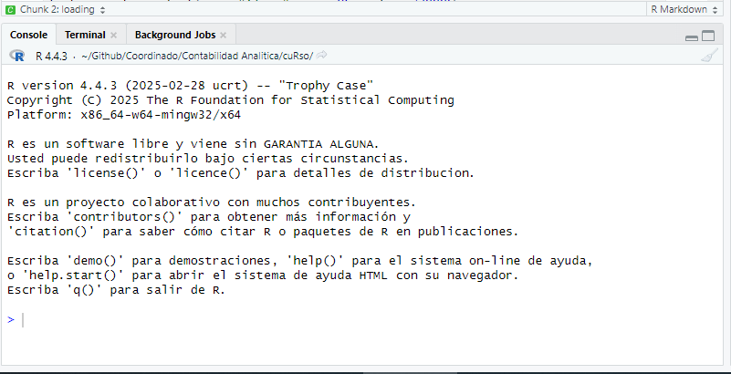
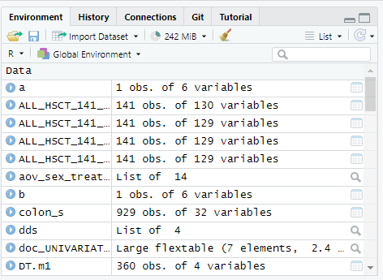
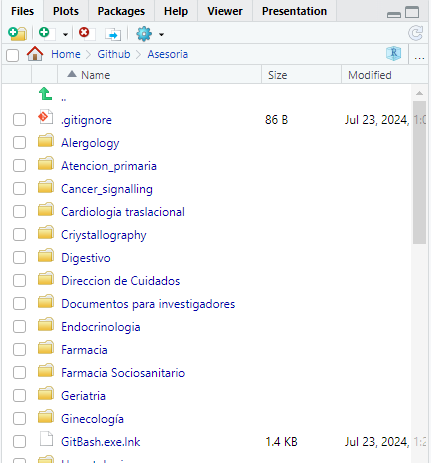

# cuRso

## Día 1:Introduction to R and Data Handling (3 hours)

R como lenguaje: La mayoría piensa en R como un programa, similar a SAS o SPSS. R es un programa, pero también es un lenguaje de programación.

R es de código abierto. (gratuito, código disponible y modificable)

R puede usarse en Mac, Linux o Windows.

**Origen**:

*"...Al principio existió S ..."*


El lenguaje S se desarrolló en 1984 como una nueva forma de realizar análisis de datos, y evolucionó a S-Plus (programa comercial).

**R** started as a poor man’s home-brewed implementation of S, for use in teaching developed by **R**obert Gentleman and **R**oss Ihaka *(hence the name R)*.

base R: lenguaje y pocas funciones

R packages (libraries): new functions for R. *[more than 20000 packages!]*

RStudio:

R no dispone de una interfaz gráfica completa (GUI).

R puede usarse con RStudio (IDE) que ayuda a visualizar, programar e interactuar con los objetos.

(hay otros IDE disponibles).

### 1.1. Instalación de R y comprensión de RStudio (60 min)

```{r installing packages}
install.packages(c("tidyverse", "DBI", "odbc", "readxl"))

```

```{r loading packages}
library(tidyverse)
library(DBI)
library(odbc)
library(readxl)
library(haven)
library(dplyr)
```

Rstudio panes:

[](https://docs.posit.co/ide/user/ide/guide/ui/ui-panes.html)

**Panel Origen**

Permite a los usuarios ver y editar varios archivos relacionados con el código, como .R, .rmd, .qmd, .py, .css o archivos de texto generales como .txt o .md. 

[](https://docs.posit.co/ide/user/ide/guide/ui/ui-panes.html)

**Panel Consola:**

De forma predeterminada, el panel de la consola es el panel inferior izquierdo.

-   **Console tab** Proporciona un área para ejecutar código de forma interactiva. De forma predeterminada, está vinculado a R, pero mediante el uso del paquete  `reticulate` también puede proporcionar una consola Python.

-   **Terminal** pestaña para ejecutar comandos del sistema, agregar o quitar terminales integrados adicionales, así como controles generales del terminal seleccionado actualmente.

[](https://docs.posit.co/ide/user/ide/guide/ui/ui-panes.html)

**Panel de Entorno de RStudio**

[](https://docs.posit.co/ide/user/ide/guide/ui/ui-panes.html)

El **Panel de entorno** muestra los objetos R y Python guardados actualmente. *(El ícono R se puede alternar entre objetos de entorno R o Python)*

```{r guardar un objeto en el entorno}
avg_mpg <- mean(mtcars$mpg)
# avg_mpg = mean(mtcars$mpg)
```

```{r eliminar onjeto del entorno}
rm(avg_mpg)

```

-   La pestaña **Historial** muestra los comandos ejecutados en la sesión actual.

-   La pestaña **Conexión** muestra las conexiones a bases de datos locales o remotas (p. ej., SQL SERVER).

-   La pestaña **Sistema de control de versiones** cambia según el sistema de control de versiones habilitado para esa sesión. *Por ejemplo*, al usar **Git**, la pestaña cambia a Git y proporciona sus propios comandos.

**Panel de salida**

El panel inferior derecho muestra diversas salidas, como gráficos, contenido HTML o archivos en disco.

[](https://docs.posit.co/ide/user/ide/guide/ui/ui-panes.html)

-   La pestaña **Archivos** ofrece una exploración interactiva del proyecto R actual y de todo el directorio.

-   La pestaña **Gráficos** muestra imágenes estáticas generadas por el código hasta que se reinicia la sesión.

La **pestaña de paquetes** permite ver los paquetes de R instalados y cuenta con una barra de búsqueda para explorar la biblioteca actual de paquetes.

La **pestaña de ayuda** se utiliza para mostrar la documentación y las viñetas de los paquetes. Incluye flechas para navegar hacia adelante y hacia atrás a medida que se visualizan las páginas de ayuda adicionales. El icono de inicio le llevará a la página de ayuda general, con enlaces a Recursos, Manuales, Referencias y Soporte de Posit.

```{r}
?paste0()
# or
help(paste0)
```

Obtener ayuda en internet. **Google y Stackoverflow** son tus aliados.

-   Actualmente, **StackOverflow** (<http://stackoverflow.com/>) es el mejor sitio de soporte de preguntas y respuestas para R. Dentro de StackOverflow, existe un colectivo de R. En la mayoría de los casos, bastará con buscar preguntas existentes y sus respuestas. Si haces una pregunta, asegúrate de que sea realmente nueva. Si hay alguna pregunta similar, explica en qué se diferencia.

-   Solicita ayuda a chatGPT/perplexity

**ChatGPT** o **perplexity** (más orientados a la ciencia de datos) te ayudarán a programar en R según tus necesidades. A veces, te dirá que algunas cosas son posibles cuando no lo son. Nunca confíes sin una revisión crítica.

**¡No introduzcas datos de pacientes en chatGPT ni en perplexity!**

### 1.2. Fundamentos de R para economistas (45 min)

Los tipos de datos de uso más común en R son los siguientes.

| Tipo            | Ejemplo | Nombre    |
|-----------------|---------|-----------|
| Entero          | 1       | integer   |
| Numérico        | 1.2     | numeric   |
| Cadena de texto | "uno"   | character |
| Factor          | uno     | factor    |
| Lógico          | TRUE    | logical   |
| Perdido         | NA      | NA        |
| Vacio           | NULL    | null      |
| Infinito        | Inf     | infinite  |

: Datos más comunes

```{r listas y vectores}
#this is a commentary 
vector_example <- c(1, 2, 3, 4, 5)#this is a commentary
fourth_vector_example<-c(1, 2, "3", 4, 5)
class(vector_example)
class(fourth_vector_example)

list_example <- list(name="Alice", age=30, salary=50000)


second_vector_example<-c("a","b","c","d","e")
third_vector_example<-1:5

```

Los dataframe están hechos de vectores

```{r dataframes}
df_other_example<-data.frame(vector_example,second_vector_example)


third_vector_example<-1:4
# df_other_example<-data.frame(vector_example,third_vector_example)


df_example <- data.frame(id=1:3, value=c(10, 20, 30))

#ejercicio:crea un data frame con tres filas y dos columnas, una columna que se llame valor con tres variables numéricas y una columna que se llame nombre con los nombres de lucas pedro y Juan
```

accediendo a los elementos de un vector

```{r}
second_vector_example[2]
second_vector_example[c(2,3)]

df_example[1,2]
df_example[2,1]
df_example[-1,]
df_example[,-1]
 #ejercicio hay que conseguir sacar  del data frame las columnas 2 y 3 de la primera persona
 #ejercicio hay que conseguir sacar  del data frame las filas 2 y 3 de la primera columna


```

```{r Bucles y condicionales}

for (i in vector_example) {
  print(i * 2)
}

if (mean(vector_example) > 3) {
  print("Above average")
}


if (mean(vector_example) > 2) {
  print("Above average")
}

if (mean(vector_example) > 3) {
  print("Above average")
}else{ print("Below average")}


# haz un bucle que toma cada uno de los valores de "vector_example" y devuelve el doble de ese elemento cunado el valor es mayor que tres y el negativo de ese elemento cuando el valor no es mayor de tres. 

```

### 1.3. Importación y exportación de datos (45 min)

```{r Reading a file}

#objetivo: leer el archivo con read.csv, eliminar la primera columna, guardarlo en un archivo de excel utilizando la librería openxlsx.

read_delim("data/synthetic_data.csv")->tabla

#eliminamos la primera columna
tabla[,-1]->tabla

read_sav("data/synthetic_data.sav")->de_archivo_spss

# openxlsx::write.xlsx(tabla,file = "data/synthetic_data.xlsx")

#abrir el excel mediante "Import  Dataset"


```

```{r Conectarse a una base de datos mediante SQL}
# con <- dbConnect(odbc(), Driver="SQL Server", Server="server_name", Database="db_name")
# df_sql <- dbGetQuery(con, "SELECT * FROM patients")

library(DBI)
library(odbc)
conexion = "Driver={SQL Server};;SERVER=CENTSQLDES06,51433;DATABASE=Milenia;Trusted_Connection=Yes"

con <- dbConnect(odbc::odbc(), .connection_string = conexion, 
    timeout = 10)
query<-"SELECT * FROM [Milenia].[at].[Dim_Acto]"
# query = "SELECT GRD_Nom, AVG(DATEDIFF(d,CAST(a.HosEst_Fecha_Ingreso as date),CAST(a.HosEst_Fecha_Alta AS date))) AS MediaTiempoGRD
# FROM [POB_DM].[lr].[TH_Hospitalizacion] a LEFT JOIN
# [POB_DM].cm.TH_CMBD b ON a.SK_Paciente= b.SK_Paciente AND a.SK_Caso=b.SK_Caso
# INNER JOIN [POB_DM].[cm].[Dim_GRD] c ON b.SK_GRD_Fin=c.SK_GRD
# --WHERE GRD_Nom='NEOPLASIAS DE RIÑÓN Y TRACTO URINARIO'
# GROUP BY GRD_Nom
# ORDER BY AVG(DATEDIFF(d,CAST(a.HosEst_Fecha_Ingreso as date),CAST(a.HosEst_Fecha_Alta AS date))) DESC"


dbGetQuery(con,query)->dim_acto

dbDisconnect(con)
```

```{r Exporting data}
openxlsx::write.xlsx(tabla,file = "data/synthetic_data.xlsx")
write_delim(dim_acto, "output.csv")
library(haven)
write_sav(tabla, "data/synthetic_data.sav")
#busca e instala la librería que permite exportar archivos a excel y guarda el las mil primeras filas de una consulta que has generado mediante sql en un archivo con nombre "prueba.xslX"

```

### 1.4. Manipulación de datos con dplyr y tidyr (1 hour)

```{r Using dplyr for data manipulation}

read_sav("data/synthetic_data_dplyr.sav")->df


#en los diagnosticos de adultos de más de 18 años, se tarda lo mismo en la consulta que diagnostica la enfermedad codificada en CIE9,CIE10 y CIAP2? lo guardaremos en un archivo que se llama "df_clean" 
#miraremos la media de tiempo de consulta para cada tipo de codificación


#en los diagnosticos de adultos de más de 18 años,
df %>%
  filter(edad > 18)


df %>%
  filter(edad > 18) %>%
  group_by(codtype) %>%
  summarize(tiempo_medio = mean(tiempo_consulta))->df_clean 

# efecto de los data faltantes
df->df2
df2$tiempo_consulta[sample(dim(df2)[1],1)]<-NA

df2%>%
  filter(edad > 18) %>%
  group_by(codtype) %>%
  summarize(tiempo_medio = mean(tiempo_consulta))->df_clean2 


df2%>%
  filter(edad > 18) %>%
  group_by(codtype) %>%
  summarize(tiempo_medio = mean(tiempo_consulta,na.rm=TRUE))->df_clean2 

#busca información sobre la función mutate de dplyr y genera una nueva columna que tenga el valor constante 7
# Cambia el nombre de la columna "9"y "10ES" por CIE9 y CIE10ES

# explora las funciones table, glimpse, dim, length, y head.
# factores: definición de un factor. Variable categórica que toma un valor limitado de niveles.
# Cambia el tipo de dato de la columna codtype a factor


```

```{r Reshaping data}
df_long <- df %>%
  pivot_longer(cols=starts_with("fecha"), names_to="evento", values_to="valor")

df_wide<-df_long%>%
  pivot_wider(names_from = evento, values_from=valor)

df_wide2<-df%>%
  pivot_wider(names_from = codtype, values_from=cod)


```

## Día 2: Advanced Data Visualization Beyond Tableau (3 hours)

### 2.1. Visualizaciones personalizadas complejas con ggplot2 (45 min)

```{r cargar los datos}
read_sav("data/synthetic_data_dplyr.sav")->df
```

```{r}
library(ggplot2)

ggplot(df, aes(x=edad))+geom_density(y="tiempo_consulta")
ggplot(df, aes(x=edad,color=codtype))+geom_density(y="tiempo_consulta")

ggplot(df, aes(x=edad, y=tiempo_consulta, color=codtype)) +
  geom_point() +
  geom_smooth(method="lm") +
  theme_minimal()

# Genera una nueva variable que distinga si un paciente es menor de 25 años o si es mayor de 25 años.  (buscar en internet, usar dplyr::mutate)

#genera una nueva variable que distinga si un paciente es menor o igual de 25 años, es mayor o igual a 26 años y menor de 70 años o si es mayor o igual de 70 años


# Genera un gráfico de cajas (boxplot) en el que se vea el tiempo de consulta en función del tio de código

#elimina de la representación todos los que tienen un NA en la vairable factor_edad3

```
