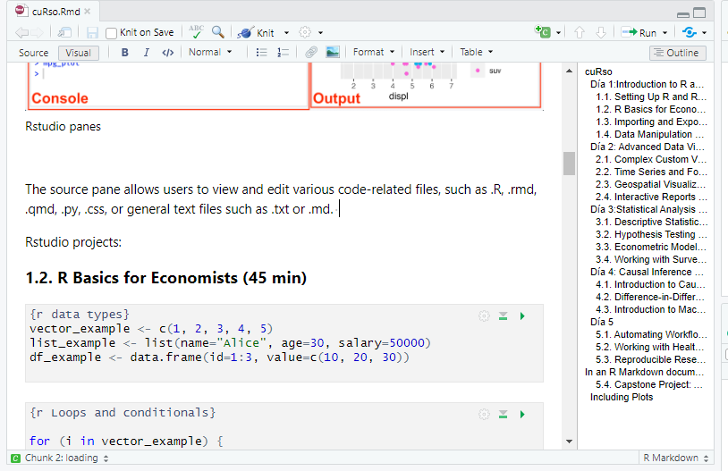

# cuRso

## Día 1:Introduction to R and Data Handling (3 hours)

R como lenguaje: La mayoría piensa en R como un programa, similar a SAS o SPSS. R es un programa, pero también es un lenguaje de programación.

R es de código abierto. (gratuito, código disponible y modificable)

R puede usarse en Mac, Linux o Windows.

**Origen**:

*"...Al principio existió S ..."*


El lenguaje S se desarrolló en 1984 como una nueva forma de realizar análisis de datos, y evolucionó a S-Plus (programa comercial).

**R** started as a poor man’s home-brewed implementation of S, for use in teaching developed by **R**obert Gentleman and **R**oss Ihaka *(hence the name R)*.

base R: lenguaje y pocas funciones

R packages (libraries): new functions for R. *[more than 20000 packages!]*

RStudio:

R no dispone de una interfaz gráfica completa (GUI).

R puede usarse con RStudio (IDE) que ayuda a visualizar, programar e interactuar con los objetos.

(hay otros IDE disponibles).

### 1.1. Instalación de R y comprensión de RStudio (60 min)

```{r installing packages}
install.packages(c("tidyverse", "DBI", "odbc", "readxl"))

```

```{r loading packages}
library(tidyverse)
library(DBI)
library(odbc)
library(readxl)
library(haven)
library(dplyr)
```

Rstudio panes:

[](https://docs.posit.co/ide/user/ide/guide/ui/ui-panes.html)

**Panel Origen**

Permite a los usuarios ver y editar varios archivos relacionados con el código, como .R, .rmd, .qmd, .py, .css o archivos de texto generales como .txt o .md. 

[](https://docs.posit.co/ide/user/ide/guide/ui/ui-panes.html)

**Panel Consola:**

De forma predeterminada, el panel de la consola es el panel inferior izquierdo.

-   **Console tab** Proporciona un área para ejecutar código de forma interactiva. De forma predeterminada, está vinculado a R, pero mediante el uso del paquete  `reticulate` también puede proporcionar una consola Python.

-   **Terminal** pestaña para ejecutar comandos del sistema, agregar o quitar terminales integrados adicionales, así como controles generales del terminal seleccionado actualmente.

[](https://docs.posit.co/ide/user/ide/guide/ui/ui-panes.html)

**Panel de Entorno de RStudio**

[](https://docs.posit.co/ide/user/ide/guide/ui/ui-panes.html)

El **Panel de entorno** muestra los objetos R y Python guardados actualmente. *(El ícono R se puede alternar entre objetos de entorno R o Python)*

```{r guardar un objeto en el entorno}
avg_mpg <- mean(mtcars$mpg)
# avg_mpg = mean(mtcars$mpg)
```

```{r eliminar onjeto del entorno}
rm(avg_mpg)

```

-   La pestaña **Historial** muestra los comandos ejecutados en la sesión actual.

-   La pestaña **Conexión** muestra las conexiones a bases de datos locales o remotas (p. ej., SQL SERVER).

-   La pestaña **Sistema de control de versiones** cambia según el sistema de control de versiones habilitado para esa sesión. *Por ejemplo*, al usar **Git**, la pestaña cambia a Git y proporciona sus propios comandos.

**Panel de salida**

El panel inferior derecho muestra diversas salidas, como gráficos, contenido HTML o archivos en disco.

[](https://docs.posit.co/ide/user/ide/guide/ui/ui-panes.html)

-   La pestaña **Archivos** ofrece una exploración interactiva del proyecto R actual y de todo el directorio.

-   La pestaña **Gráficos** muestra imágenes estáticas generadas por el código hasta que se reinicia la sesión.

La **pestaña de paquetes** permite ver los paquetes de R instalados y cuenta con una barra de búsqueda para explorar la biblioteca actual de paquetes.

La **pestaña de ayuda** se utiliza para mostrar la documentación y las viñetas de los paquetes. Incluye flechas para navegar hacia adelante y hacia atrás a medida que se visualizan las páginas de ayuda adicionales. El icono de inicio le llevará a la página de ayuda general, con enlaces a Recursos, Manuales, Referencias y Soporte de Posit.

```{r}
?paste0()
# or
help(paste0)
```

Obtener ayuda en internet. **Google y Stackoverflow** son tus aliados.

-   Actualmente, **StackOverflow** (<http://stackoverflow.com/>) es el mejor sitio de soporte de preguntas y respuestas para R. Dentro de StackOverflow, existe un colectivo de R. En la mayoría de los casos, bastará con buscar preguntas existentes y sus respuestas. Si haces una pregunta, asegúrate de que sea realmente nueva. Si hay alguna pregunta similar, explica en qué se diferencia.

-   Solicita ayuda a chatGPT/perplexity

**ChatGPT** o **perplexity** (más orientados a la ciencia de datos) te ayudarán a programar en R según tus necesidades. A veces, te dirá que algunas cosas son posibles cuando no lo son. Nunca confíes sin una revisión crítica.

**¡No introduzcas datos de pacientes en chatGPT ni en perplexity!**

### 1.2. Fundamentos de R para economistas (45 min)

Los tipos de datos de uso más común en R son los siguientes.

| Tipo            | Ejemplo | Nombre    |
|-----------------|---------|-----------|
| Entero          | 1       | integer   |
| Numérico        | 1.2     | numeric   |
| Cadena de texto | "uno"   | character |
| Factor          | uno     | factor    |
| Lógico          | TRUE    | logical   |
| Perdido         | NA      | NA        |
| Vacio           | NULL    | null      |
| Infinito        | Inf     | infinite  |

: Datos más comunes

```{r listas y vectores}
#this is a commentary 
vector_example <- c(1, 2, 3, 4, 5)#this is a commentary
fourth_vector_example<-c(1, 2, "3", 4, 5)
class(vector_example)
class(fourth_vector_example)

list_example <- list(name="Alice", age=30, salary=50000)


second_vector_example<-c("a","b","c","d","e")
third_vector_example<-1:5

```

Los dataframe están hechos de vectores

```{r dataframes}
df_other_example<-data.frame(vector_example,second_vector_example)


third_vector_example<-1:4
# df_other_example<-data.frame(vector_example,third_vector_example)


df_example <- data.frame(id=1:3, value=c(10, 20, 30))

#ejercicio:crea un data frame con tres filas y dos columnas, una columna que se llame valor con tres variables numéricas y una columna que se llame nombre con los nombres de lucas pedro y Juan
```

accediendo a los elementos de un vector

```{r}
second_vector_example[2]
second_vector_example[c(2,3)]

df_example[1,2]
df_example[2,1]
df_example[-1,]
df_example[,-1]
 #ejercicio hay que conseguir sacar  del data frame las columnas 2 y 3 de la primera persona
 #ejercicio hay que conseguir sacar  del data frame las filas 2 y 3 de la primera columna


```

```{r Bucles y condicionales}

for (i in vector_example) {
  print(i * 2)
}

if (mean(vector_example) > 3) {
  print("Above average")
}


if (mean(vector_example) > 2) {
  print("Above average")
}

if (mean(vector_example) > 3) {
  print("Above average")
}else{ print("Below average")}


# haz un bucle que toma cada uno de los valores de "vector_example" y devuelve el doble de ese elemento cunado el valor es mayor que tres y el negativo de ese elemento cuando el valor no es mayor de tres. 

```


