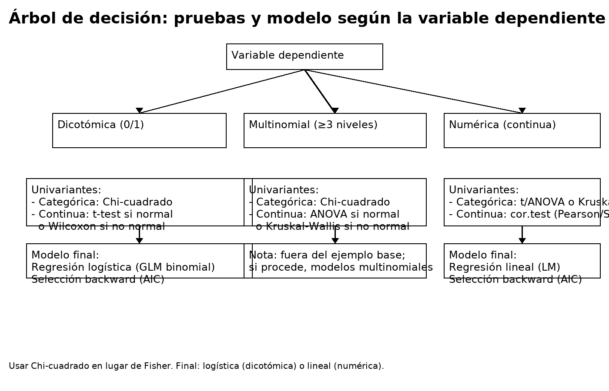

> Dataset Kaggle: **Diabetes 130-US hospitals (1999–2008)** → `diabetic_data.csv`.
>
> Descargar desde <https://github.com/ibaitamayo/Taller_PI/blob/main/cuRso/data/diabetic_data.csv>
>
> y guardar en la carpeta datos y cargar los datos en el entorno.
>
> Carga las librerías necesarias para las funciones (mirar la tabla de ayuda)

## 1. Guía por objetivos y pseudocódigo

**Pregunta tipo:**\
1) ¿Qué variables se relacionan con la **presencia de complicaciones**?\
2) Genera un **informe científico** con asociaciones univariantes y multivariantes.\
3) Propón **recomendaciones** a gestores.

## 2. Árbol de decisión

## 3. Tabla de funciones clave

| Librería | Función                                                        | Uso                             |
|------------------------|------------------------|------------------------|
| dplyr    | `mutate`, `if_else`, `select`, `filter`, `across`, `case_when` | Derivar variables y seleccionar |
| finalfit | `summary_factorlist`                                           | Tabla 1 con totales y p-values  |
| stats    | `chisq.test`, `t.test`, `wilcox.test`                          | Pruebas univariantes            |
| stats    | `glm(family=binomial)`                                         | Logística binaria               |
| MASS     | `stepAIC`                                                      | Backward por AIC                |
| broom    | `tidy`                                                         | Coeficientes con IC95%          |

------------------------------------------------------------------------

## 

**Pasos y pseudocódigo (no ejecutar tal cual):**

Para generar una sección en la que se pueda ejecutar código pulsa simultáneamente:

**control + alt + i**

1.  Cargar datos (a) y crear variable dicotómica (binaria) “complicaciones” buscando en la variable `readmitted` aquellos pacientes que reingresan antes de 30 días (b)

·       a)Objetivo:poner datos en el entorno

·        Pseudocódigo: \
`read.csv("carpeta/nombre_archivo.csv")`

·       b)Objetivo: definir 0/1.

·        Pseudocódigo: \
`mutate(complication_bin = if_else(readmitted == "<30", 1, 0))`

¿Qué indica esta variable?

2.  **Explicativas y tipos**

            Objetivo: 

    ·        Sugerencia: age (como punto medio), gender, race, time_in_hospital, num_lab_procedures, num_medications, number_diagnoses, insulin, change, payer_code.

3.  **Tabla univariante con totales (chi-cuadrado, t/Wilcoxon)**

    ·        Objetivo: elegir clínicas, demográficas y económicas plausibles; fijar relaciones y p-values.

    ·        Test: **chi-cuadrado** para categóricas; **t** si normal o **Wilcoxon** si no normal para continuas.
    ·        Sugerencia de explicativas: age (como punto medio), gender, race, time_in_hospital, num_lab_procedures, num_medications, number_diagnoses, insulin, change, payer_code.

    ·        Pseudocódigo:

    o   categórica vs y: chisq.test(table(y, x_cat))

    o   continua vs y: t.test(x_num \~ y) y wilcox.test(x_num \~ y)\
    `summary_factorlist(dependent = y, explanatory = c(...), column = TRUE, p = TRUE, na_include = TRUE)`

4.  **Selección p\<0.05**

    ·        Objetivo: marcar p\<0.05.

    ·        Pseudocódigo: sig \<- vars[p \< 0.05], se puede hacer a mano\
    `sig <- tab1 |> filter(!is.na(p) & p < 0.05) |> pull(label)`

5.  **Modelo completo (logística)**

    ·        Objetivo: logística con todas las significativas y clínicamente relevantes (separadas por **+**).

    ·        Pseudocódigo: m_full \<- glm(y \~ sig, family=binomial)\
    `mod_full <- glm(variable dependiente ~ variable explicativa 1+ variable explicativa 2 + variable explicativa 3..., family=binomial, data=df)`

6.  **Backward (AIC)**

    ·        Objetivo: Modelo mas simple pero que explora relaciones independientes. Se puede hacer a mano. Eliminar las que no son significativas del modelo completo. **Una a una hasta quedarse con variables que son todas significativas.**

    ·        (si se quiere con código ...hacer algo del estilo : m_back \<- step(m_full, direction="backward")\
    `mod_back <- MASS::stepAIC(mod_full, direction="backward")`

7.  **OR e IC95% + informe**

            Objetivo: OR, IC95%, p.

    ·        Pseudocódigo: OR \<- exp(coef(m_back)); IC \<- exp(confint(m_back))

    ·        Informe IMRyD: métodos, resultados (Tabla 1 + tabla del modelo), discusión, limitaciones, recomendaciones.

    \
    `broom::tidy(mod_back, conf.int=TRUE, exponentiate=TRUE) |> filter(term!='(Intercept)')`

